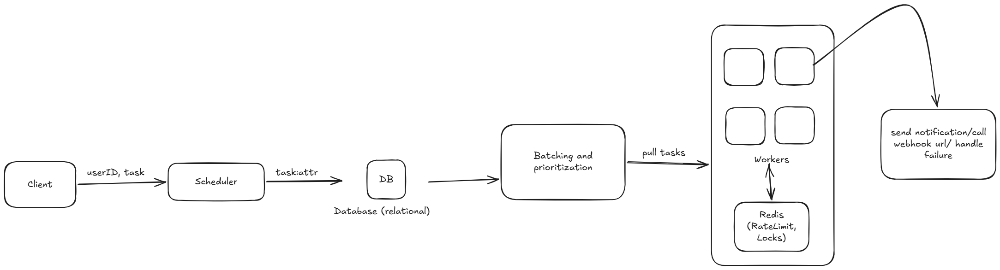

# System Design: NotifyQueue

This document outlines the architecture, data models, and trade-offs of the NotifyQueue distributed delayed job & notification delivery system.

## Functional Reqs

1. Schedule notification jobs for future execution using either a delay or an absolute send time.
2. Deliver notifications through multiple channels (Email, SMS, Push).
3. Prioritize urgent notifications over lower-priority jobs.
4. Guarantee exactly-once delivery even with multiple concurrent worker instances.
5. Retry transient failures using exponential backoff.
6. Move permanently failing jobs into a Dead Letter Queue.
7. Prevent duplicate scheduling using idempotency keys.
8. Enforce recipient-based rate limits.
9. Notify external systems through webhooks whenever a job status changes.
10. Provide APIs for querying job status and overall system metrics.

## Non-Functional Reqs

1. Availability: Workers and API instances can be scaled horizontally
2. Durability: Scheduled jobs persist even if workers crash.
3. Scalability: Support millions of scheduled jobs and thousands of workers.
4. Fault Tolerance: Failed deliveries are retried automatically
5. Consistency: No duplicate notification deliveries under concurrent processing
6. Low Latency: High-priority notifications are processed before lower-priority jobs

## Components

1.  **FastAPI Application:** Exposes REST APIs for scheduling notifications, querying job status, retrieving metrics, and registering webhook endpoints.
2.  **PostgreSQL Database:** The durable source of truth. Stores jobs, dead letters, and webhook configurations. Guaranteed ACID properties ensure we don't lose jobs.
3.  **Redis:** The high-performance coordination layer. Used for distributed locking (preventing duplicate processing) and sliding-window rate limiting.
4.  **Worker Processes:** Independent, scalable Python processes that poll the database for due jobs, claim them via Redis locks, and process deliveries.

## High-Level Architecture

## Distributed Worker Coordination

The system allows many worker processes to execute concurrently without delivering duplicate notifications.

### Distributed Lock

When a worker finds a due job, it first attempts to acquire a distributed lock in Redis. This is an atomic $O(1)$ operation. The lock includes a TTL (e.g., 5 minutes) to handle worker crashes.

### Compare-And-Swap (CAS)

After acquiring the Redis lock, the worker performs an atomic update: `UPDATE jobs SET status = 'claimed' WHERE id = :id AND status = 'pending'`. In this case if exactly one row is updated, the worker owns the job. Otherwise, another worker already claimed it, so it releases the lock and skips the job

## Exactly-Once Delivery

Exactly-once delivery is achieved using two independent mechanisms:

1. Redis distributed locking prevents multiple workers from processing the same job simultaneously.
2. PostgreSQL Compare-And-Swap guarantees only one worker can transition a job from Pending to Claimed.
3. Provider-side Idempotency: the job's UUID is passed to external providers (Email/SMS APIs) to prevent duplicate sends if a worker crashes after sending but before updating the database. Key assumption.

While a pure PostgreSQL approach using `SELECT ... FOR UPDATE SKIP LOCKED` is common, i chose to maximize performance and decouple the locking mechanism from the database engine.

## Priority Scheduling

Workers retrieve due jobs ordered by: `Priority DESC, Send Time ASC`. This guarantees that urgent notifications execute first, and notifications of equal priority are processed chronologically.

## Recipient Rate Limiting

Each recipient has a configurable notification limit (for example, 10 notifications per hour) and the rate limiter algortithm used is sliding-window. Given a user has reached a rate limit, the job is defferred by updating its next execution time instead of failing it. This ensures notifications are delayed rather than discarded.

## Retry Strategy

Transient delivery failures are retried automatically. Each failure increments the retry count. The next execution time is calculated using exponential backoff. A small random jitter is added to prevent many failed jobs from retrying simultaneously.

## Dead Letter Queue

When the retry count exceeds the configured maximum, the notification is marked as Dead Lettered, and is copied into the dead_letter_jobs table, afterwhich no further retry attempts are made. This prevents permanently failing notifications from consuming worker capacity indefinitely.

## Idempotency

All jobs have an idempotency key. Before creating a new notification, the API checks whether that key already exists. If it exists, the existing job is returned, else a new job is created.

## Webhook Notifications

Clients can register webhook endpoints to receive asynchronous status updates. Workers invoke registered webhooks whenever a notification transitions to one of the following states: Sent, Failed, Dead Lettered.

## Webhook Notifications

The API exposes lightweight system metrics including: pending jobs,sent jobs,failed jobs, dead-lettered jobs.

## Scalability

The architecture scales horizontally at every layer.

### API

Multiple FastAPI instances can run behind a load balancer.

### Workers

Worker processes are stateless and can be increased independently based on workload.

### PostgreSQL

Handles durable storage and efficient polling through indexed queries.

### Redis

Provides low-latency distributed coordination for locks and rate limiting without placing additional contention on the database.

## Potential Bottleneck

1. At very large scale, the polling architecture becomes the primary bottleneck, as many workers repeatedly query the database for due jobs. In a future design, i would replace database polling with an event-driven architecture where a dispatcher monitors newly due jobs, pushes job IDs into a distributed message broker (RabbitMQ, Kafka, or Amazon SQS), and workers consume directly from the broker.
2. Another bottleneck is the current ID generation. In a geographically distributed system, this will not scale to handle ID uniqueness. In a future design, i would replace the UUID generator with a distributed sequencer.
